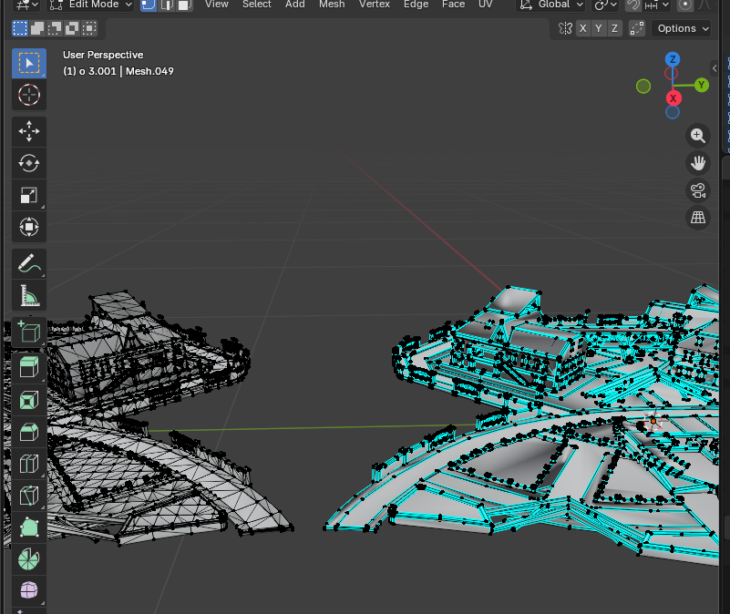

<p align="center">
  
</p>

# FreeFayer Low-Poly Converter (FreeFayer.py)

**FreeFayer Low-Poly Converter** is a command-line Blender automation tool designed to convert high-poly 3D assets into mobile-optimized FBX models, mainly for **Free Fire Craftland** and other low-end mobile games.

---
## Preview


## Features

- Supports input formats: `.fbx`, `.obj`, `.glb`, `.gltf`
- Always exports optimized `.fbx` files
- Automatic polygon and vertex reduction
- Building-safe geometry optimization (prevents wall and shape distortion)
- Hard triangle limit per mesh
- Flat shading for architectural models
- Mesh merging for improved rendering performance (FPS)
- No external Python dependencies required
- Helps avoid map rejection caused by high-poly assets

---

## 📦 Requirements

- Blender **5.0+**
- Windows **10 / 11**

---

## ⚙️ Installation

1. Clone or download this repository.
2. Place `FreeFayer.py` in any directory on your system.

---

## ▶ Usage

```bash
blender.exe --background --python FreeFayer.py
```
You will be prompted to enter:
- Input 3D model path
- Output file name (without extension)

The optimized file will be saved as: `{output_name}.fbx`
